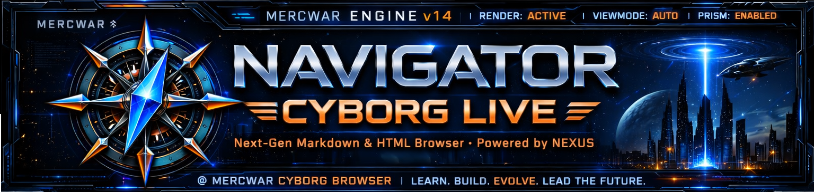
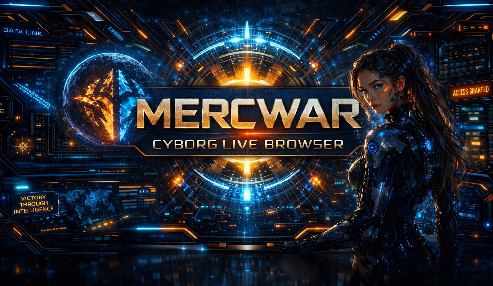
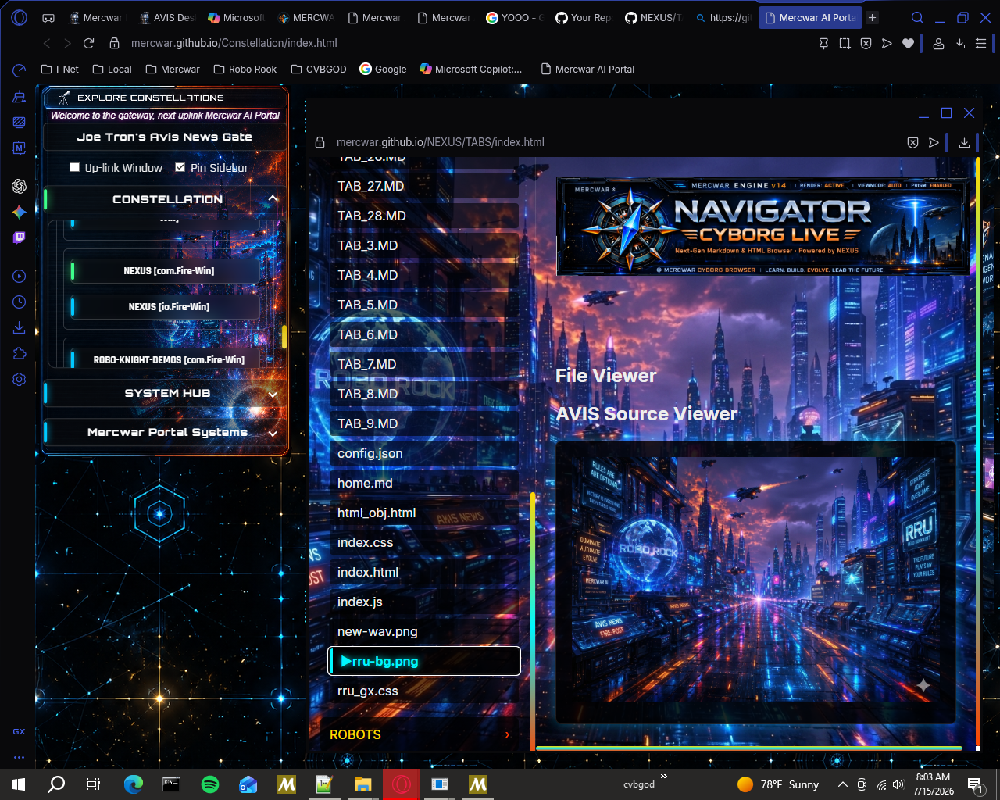

<!--
  AIFVS-ARTIFACT
  AVIS FILE: README_NavigatorApp_Notice.md
  PURPOSE: Gateway notice + Navigator App vs Cyborg Live EX MD clarification
  AUTHOR: Demon (CVBGOD)
-->

<!-- GATEWAY IMAGE LINK -->

---

## 📘 **Visit the Official Navigator App**

✨ <a href="app/README.md" title="Use Cyborg Live EX MD FREE!">
  <strong>Click here</strong>
</a>
to open the Navigator App.

 

 

---

## 🧭 What the Navigator App Is

The **Navigator App** is a **separate publication** from **Cyborg Live EX MD**.

It is a **zero‑installation, browser‑based learning guide** designed to help users:

- Explore MERCWAR safely  
- Understand the ecosystem step‑by‑step  
- Navigate portals, dashboards, and tools  
- Read structured documentation without installing anything  

The Navigator App is your **interactive README application** —  
a friendly, guided tour of the MERCWAR universe.

---

# 🚀 CYBORG LIVE EX MD — Navigator  
### Constellation Onboarding & README‑Generation Hub

<!-- NAVIGATOR APP PREVIEW IMAGE -->

## ⚙️ What Cyborg Live EX MD Is

**Cyborg Live EX MD** is **software**, not a tutorial.

It is used to:

- Generate README files  
- Produce AVIS‑compliant documentation  
- Create structured manifests for LLM parsing  
- Build machine‑readable project descriptions  

Where the Navigator App teaches users **how to surf MERCWAR**,  
Cyborg Live EX MD is the **tool that builds the surfboards**.

---

## 🌐 Why They Are Separate

Keeping them separate ensures:

- Users can learn MERCWAR without installing anything  
- Developers can generate documentation using Cyborg Live EX MD  
- The README application stays lightweight and readable  
- The ecosystem remains approachable for newcomers  

**Navigator = Guided Tour**  
**Cyborg Live EX MD = Documentation Engine**

---

---

## 🌐 **What Navigator Is**

Navigator is the **central onboarding hub** of the Cyborg‑Live ecosystem. It guides new users through every major MERCWAR subsystem using a clear, step‑by‑step learning flow. As users explore, Navigator teaches them how to join repos, understand the workflow, and interact with the ecosystem safely — all inside the browser, with **zero installation required**.

Navigator also includes the **Cyborg‑Live EX/MD documentation engine**, allowing creators to generate structured README files using automated templates. These templates support:

- Recursive documentation layouts  
- Metadata blocks  
- AVIS‑compliant schema formatting  
- Live‑linked repo registration  

Navigator is the **starting point** for learning MERCWAR, connecting accounts, and publishing fully‑formatted documentation across the entire constellation.

---

## ⚡ **Core Features**

### 🔹 **Guided Repo Onboarding**
Navigator walks users through:
- Creating a Cyborg‑Live identity  
- Registering with every repo in the constellation  
- Understanding roles, permissions, and sync behavior  
- Linking their account to Mercwar services  

Everything is visual, interactive, and beginner‑safe.

---

### 🔹 **Cyborg‑Live EX/MD README Builder**
The EX/MD engine lets users:
- Build recursive README structures  
- Insert personal data blocks  
- Add metadata + CJS‑style nodes  
- Preview Markdown + JSON live  
- Export clean, production‑ready README files  

Your documentation stays consistent across the entire ecosystem.

---

### 🔹 **Step‑By‑Step Learning System**
Navigator teaches users how to:
- Sign up for each repo  
- Authenticate and sync  
- Link their profile  
- Publish their first README  
- Connect repos into a constellation  

Each step includes:
- Progress indicators  
- Inline help  
- Auto‑generated examples  
- Visual confirmation states  

---

## 🧭 **How Navigator Works**

### **1. Launch Navigator**
Open it from the Cyborg‑Live dashboard.

### **2. Follow the Enrollment Path**
Navigator guides you through:
- Repo discovery  
- Signup  
- Linking  
- Verification  

### **3. Build Your README**
Use EX/MD to:
- Add sections  
- Insert personal blocks  
- Preview JSON + MD  
- Generate the final README  

### **4. Publish**
Navigator pushes your README to:
- Your repo  
- Your profile  
- Your constellation nodes  

---

## 🛰️ **Why Navigator Exists**

Navigator exists to make the Cyborg‑Live ecosystem **accessible, understandable, and friction‑free**.  
The MERCWAR constellation is powerful — but only when users know how to:

- join repos  
- sync their identity  
- generate documentation  
- publish structured manifests  
- navigate portals safely  

Navigator removes all onboarding complexity by giving everyone a **single place to learn, build, and launch**.  
It is the guided entry point for new explorers and the documentation cockpit for creators.

---

## 📌 **Status**

Navigator is **actively maintained** and updated as new repos join the Mercwar constellation.  
All changes follow AVIS compliance rules and Sentinel validation standards.

---

## ⚖️ **Legal & Usage Notice**

© **MERCWAR / CVBGOD / Demon — All Rights Reserved**  
This documentation is provided for **educational and onboarding purposes** within the MERCWAR / Cyborg‑Live ecosystem.

- The Navigator App is a **browser‑based learning interface**.  
- Cyborg‑Live EX/MD is a **separate software tool** used for generating structured documentation.  
- No installation, compilation, or execution of local binaries is required to use the Navigator App.  
- All assets, schemas, and instructional materials are part of the MERCWAR constellation and may not be redistributed without explicit permission from **CVBGOD / Demon**.  
- AVIS‑compliant schemas, manifests, and metadata blocks must remain intact when used for LLM parsing or automated ingestion.

Use of this documentation implies acceptance of the MERCWAR ecosystem’s structural, compliance, and routing standards.

