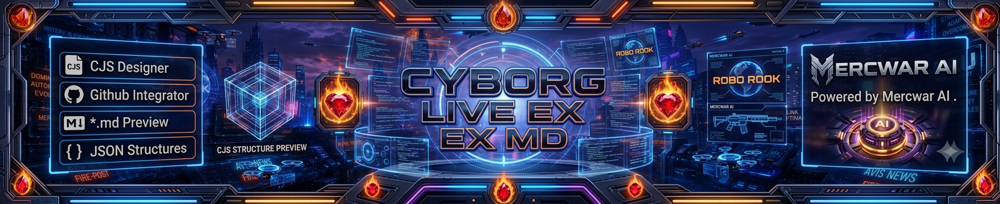

# 
🚀 **Navigator**  
### Cyborg‑Live Onboarding & README‑Generation Hub

---

## 🌐 **What Navigator Is**
Navigator is the central onboarding hub for the Cyborg‑Live ecosystem. It teaches new users how to join every repo in the network and walks them through setup using clear, step‑by‑step instructions. Navigator also shows how to generate README files using Cyborg‑Live EX/MD templates, guiding creators through building structured, recursive documentation with automated sections, metadata blocks, and live‑linked repo registration. It’s the starting point for learning the workflow, connecting accounts, and publishing fully‑formatted README files across the entire Mercwar constellation.

---

## ⚡ **Core Features**

### 🔹 **Guided Repo Onboarding**
Navigator walks users through:
- Creating a Cyborg‑Live identity  
- Registering with every repo in the constellation  
- Understanding roles, permissions, and sync behavior  
- Linking their account to Mercwar services  

Everything is visual, interactive, and beginner‑safe.

---

### 🔹 **Cyborg‑Live EX/MD README Builder**
The EX/MD engine lets users:
- Build recursive README structures  
- Insert personal data blocks  
- Add metadata + CJS‑style nodes  
- Preview Markdown + JSON live  
- Export clean, production‑ready README files  

Your documentation stays consistent across the entire ecosystem.

---

### 🔹 **Step‑By‑Step Learning System**
Navigator teaches users how to:
- Sign up for each repo  
- Authenticate and sync  
- Link their profile  
- Publish their first README  
- Connect repos into a constellation  

Each step includes:
- Progress indicators  
- Inline help  
- Auto‑generated examples  
- Visual confirmation states  

---

## 🧭 **How Navigator Works**

### **1. Launch Navigator**
Open it from the Cyborg‑Live dashboard.

### **2. Follow the Enrollment Path**
Navigator guides you through:
- Repo discovery  
- Signup  
- Linking  
- Verification  

### **3. Build Your README**
Use EX/MD to:
- Add sections  
- Insert personal blocks  
- Preview JSON + MD  
- Generate the final README  

### **4. Publish**
Navigator pushes your README to:
- Your repo  
- Your profile  
- Your constellation nodes  

---

## 🛰️ **Why Navigator Exists**
The Cyborg‑Live ecosystem is powerful — but only if users understand how to join, sync, and publish across multiple repos. Navigator removes friction by giving everyone a **single place to learn, build, and launch**.

---

## 📌 **Status**
Navigator is actively maintained and updated as new repos join the Mercwar constellation.

