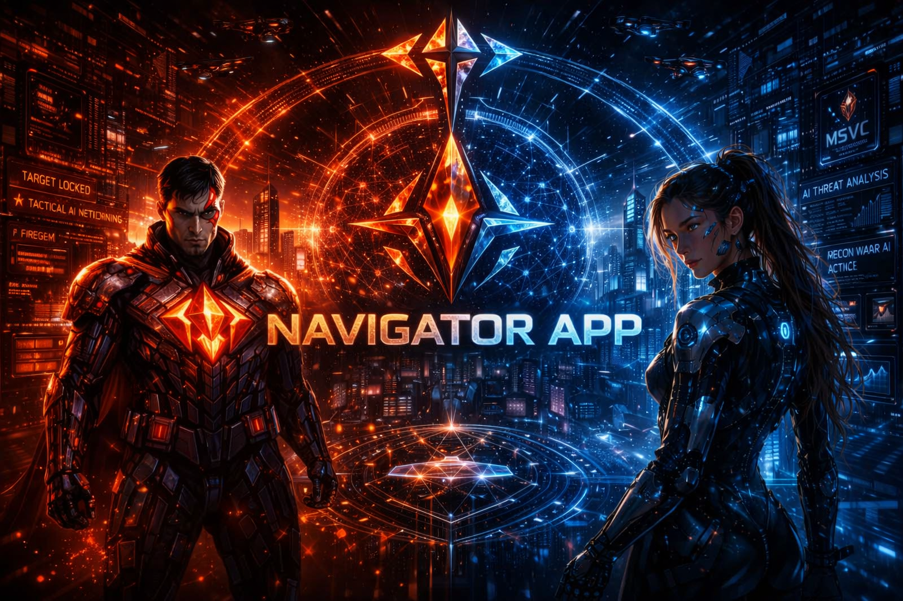

<!-- 
   AIFVS-ARTIFACT  
   AVIS FILE: README.md  
   PURPOSE: Master Gateway for MERCWAR Browsable Documentation  
   AUTHOR: Demon (CVBGOD)  
   NOTES: Zero-installation entry point  
-->

# MERCWAR AI • CYBORG‑LIVE • Zero‑Installation Guide

Welcome to the MERCWAR AI ecosystem. 

- This documentation app lets you explore every subsystem directly in your browser.
- Mercwar AI is public on github.
- No downloads required !
- No installs required !
- No compilers required !
- Anyone can browse Mercwar for free without needing to install.

## 📘 Table of Contents
- [Tutorial](./README_Getting_Started.md)
- [Constellation & Portal Navigation](./README_Constellation.md)
- [Cyborg Engine & Automation](./README_Cyborg.md)
- [Fire‑Gem & FIRE‑PUNK Console](./README_FireGem.md)
- [AVIS Standard & Sentinel Compliance](./README_AVIS.md)
- [Robo‑Knight Visual Universe](./README_RoboKnight.md)
- [Navigator Documentation Wizard](./README_Navigator.md)
- [Git‑Browser & Repo Inspection](./README_GitBrowser.md)

## 🌐 Zero‑Installation Browsing

Everything in MERCWAR can be explored:
- In your browser  
- On GitHub Pages  
- Without touching your local machine  

This README app is your guided tour.
